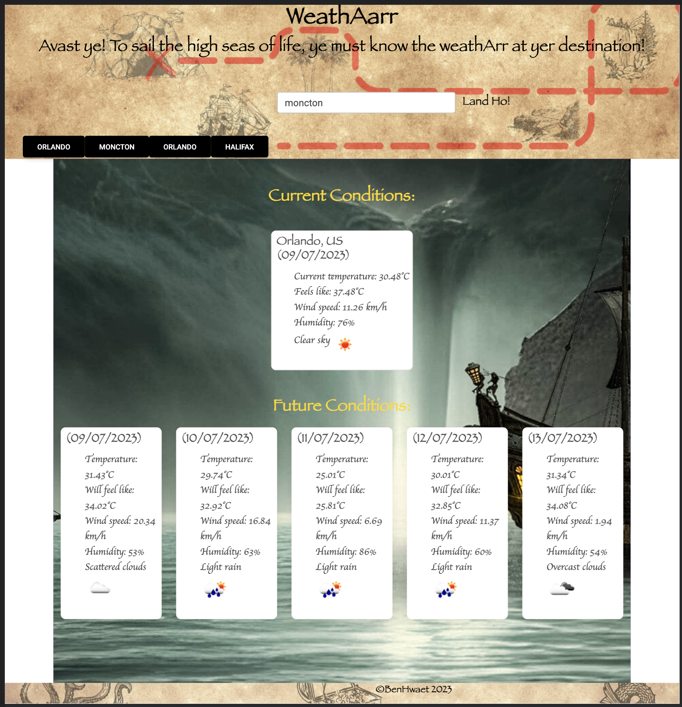

# WeathAarr

A piratically themed weather app.

## Description

This weather dashboard app permits the user to search the current and future weather conditions of a city. The User Story and Acceptance Criteria for the app are included below and in the README file provided by edX in the course of a Full Stack Bootcamp hosted by UNB. (See Credits)

### User Story

```
AS A traveler
I WANT to see the weather outlook for multiple cities
SO THAT I can plan a trip accordingly
```

### Acceptance Criteria

```
GIVEN a weather dashboard with form inputs
WHEN I search for a city
THEN I am presented with current and future conditions for that city and that city is added to the search history
WHEN I view current weather conditions for that city
THEN I am presented with the city name, the date, an icon representation of weather conditions, the temperature, the humidity, and the wind speed
WHEN I view future weather conditions for that city
THEN I am presented with a 5-day forecast that displays the date, an icon representation of weather conditions, the temperature, the wind speed, and the humidity
WHEN I click on a city in the search history
THEN I am again presented with current and future conditions for that city
```

## Usage

To make use of this application, the user must simply type in the name of the target city in the text box, that city's current and future weather data - which includes the temperature in Celsius, the feels-like temperature, the humidity, wind speed and matching weather icon - is then displayed in weather cards for the current day and the following 5 days.

Each city searched is saved to local storage and a button is generated in the navbar. The user can then click on these search history buttons to re-generate the displayed city's weather information in the dashboard.

The website is deployed through Git Hub Pages at <https://benhwaet.github.io/WeathAarr/#!>.




## Roadmap

Currently, acceptance criteria elements are fulfilled. However, the generated city buttons are not persistent on page refresh and if the city is searched more than once, or if the buttons are clicked to regenerate the information, duplicate city buttons appears.
Ideally, if a city already has a dedicated button, no duplicate should appear. Furthermore, these search-history buttons should remain in the navbar on page refresh. The fully optimized app should also limit the number of generated search-history buttons to seven, because I like that number and five is too few.
The website should also be made more responsive to different screen sizes.

## Credits

The user story and acceptance criteria were provided by edX in a Full-Stack Bootcamp hosted by the University of New Brunswick (UNB) and are contained in the challengeREADME file.
This application used bootstrap as a starting point for a weather search app and also uses Font Awesome, Google Fonts, and MDB styling options.
Some of the javascript code was inspired by or sourced from users on stackoverflow, most specifically the way to fetch the weather icon from the openweathermaps API, as is indicated in to comments of the code.

## License

© BenHwaet 2023

This project used the MIT License. Full license information is included in the project files and project REPO at <https://github.com/Benhwaet/WeathAarr>.
